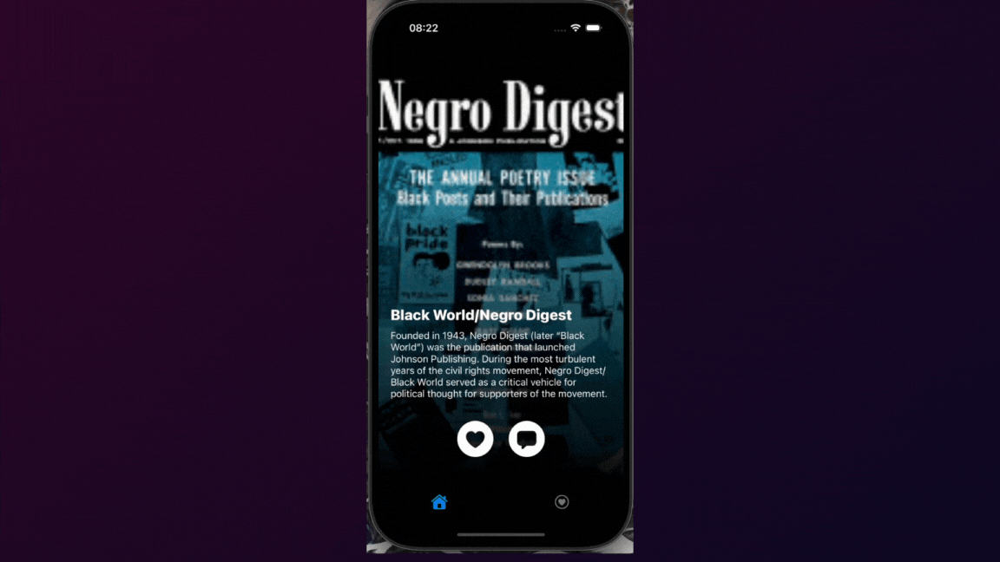

# BookTok for iOS
BookTok is an innovative app for book lovers and content seekers, inspired by the viral trends of TikTok. It allows users to discover new books, interact with others, and share their favorites in a seamless and fun environment.

## Features
- **Book Discovery**: Users can discover new books in a random mode of for specific author similar to TikTok’s experience.
- **Custom randomization algorithm**: The first letter, page, and offset of the request to API change on each user's swipe.
- **Commenting**: Users can leave notes on the book that automatically add it to featured.
- **Liked Books**: Users can save their liked books, view them in a personalized list.

## Technology Stack
- **Swift + UIKit**
- **Core Data**: Used for persistent storage.
- **Google Books API**: Provides access to a large collection of books.
- **MVVM architecture**: Improves separation of concerns, data binding, and testability.

## Installation
Clone the repository and open the project in Xcode. To run the app on a physical device or simulator:
1. Make sure you have Xcode installed.
2. Clone this repository.
3. Open the `BookTok.xcodeproj` in Xcode.
4. Run the app on a simulator or a physical device.
5. Enjoy just like the cat!
   

